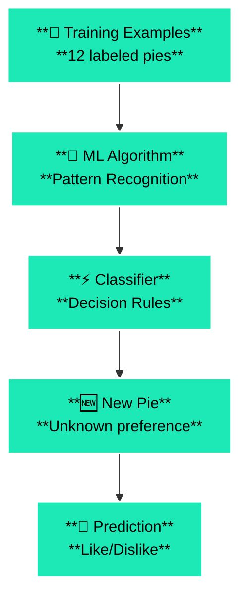
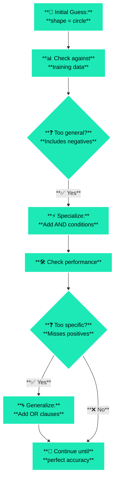
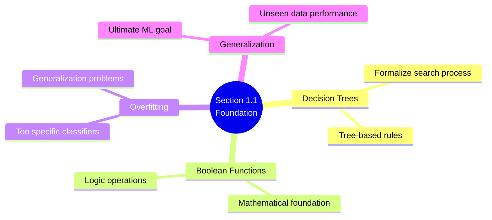

# 1.1 Training sets and classifiers

## 🎯 **Learning Objectives**

By the end of this section, you will master:

- ✅ **Training Set** fundamentals and components
- ✅ **Classifier** development and evaluation
- ✅ **Attribute Vector** representation
- ✅ **Instance Space** calculation and complexity
- ✅ **Evaluation metrics** and confusion matrices

## 📚 **Core Concepts Deep Dive**

## 🏗️ **1. Training Set**

**Definition:** A collection of pre-classified examples that serve as input for machine learning

> 💡 Real-World Analogy: Like showing a child 100 photos labeled "dog" and "cat" to teach them to recognize these animals in new photos
> 

**Key Components:**

- 🟢 **Positive Examples:** Instances of the concept we want to learn (Johnny's liked pies)
- 🔴 **Negative Examples:** Counter-examples that don't belong to the concept (Johnny's disliked pies)

## 🤖 **2. Classifier**

**Definition:** An algorithm that categorizes new, unseen examples into predefined classes

> 💡 Real-World Analogy: A medical diagnostic system that looks at symptoms and predicts if a patient has a specific disease
> 

**Purpose:** Transform training data into decision-making rules

## 📊 **3. Attribute Vectors**

**Definition:** Numerical or categorical descriptions of examples using specific features

> 💡 Real-World Analogy: Like a dating profile - height, age, interests, etc. describe a person
> 

## 🥧 **The Pie Example: Complete Walkthrough**

## 🎯 **Problem Setup**

| Element | Description |
| --- | --- |
| **Goal** | Predict which pies Johnny will like |
| **Input** | 12 labeled pies (6 positive, 6 negative) |
| **Output** | A classifier that can predict Johnny's preference for any new pie |

## Table 1.1: The Twelve Training Examples (Recreated from Kubat)

| Example | Shape | Crust Size | Crust Shade | Filling Size | Filling Shade | Class |
| --- | --- | --- | --- | --- | --- | --- |
| ex1 | Circle | Thick | Gray | Thick | Dark | pos |
| ex2 | Circle | Thick | White | Thick | Dark | pos |
| ex3 | Triangle | Thick | Dark | Thick | Gray | pos |
| ex4 | Circle | Thin | White | Thin | Dark | pos |
| ex5 | Square | Thick | Dark | Thin | White | pos |
| ex6 | Circle | Thick | White | Thin | Dark | pos |
| ex7 | Circle | Thick | Gray | Thick | White | neg |
| ex8 | Square | Thick | White | Thick | Gray | neg |
| ex9 | Triangle | Thin | Gray | Thin | Dark | neg |
| ex10 | Circle | Thick | Dark | Thick | White | neg |
| ex11 | Square | Thick | White | Thick | Dark | neg |
| ex12 | Triangle | Thick | White | Thick | Gray | neg |

*Data source: Kubat, M. (2021). An Introduction to Machine Learning, Table 1.1*

## 📋 **Attributes Used**

| Attribute | Possible Values | Count |
| --- | --- | --- |
| **Shape** | circle, triangle, square | 3 |
| **Crust-size** | thin, thick | 2 |
| **Crust-shade** | white, gray, dark | 3 |
| **Filling-size** | thin, thick | 2 |
| **Filling-shade** | white, gray, dark | 3 |

## 🔄 **Machine Learning Process Flow**



## 🔍 **Instance Space Analysis**

## 📐 **Size Calculation**

**Formula:** Product of all possible attribute values

```
Instance Space = Shape × Crust-size × Crust-shade × Filling-size × Filling-shade
Instance Space = 3 × 2 × 3 × 2 × 3 = 108 possible pies
```

## 🚫 **Why Brute Force Fails**

| Problem Aspect | Value | Impact |
| --- | --- | --- |
| **Possible Pies** | 108 | Manageable |
| **Possible Classification Rules** | 2^108 | **324,518,553,658,426,726,783,156,020,576,256,000,000,000,000** |
| **Testing Time (1B rules/sec)** | > Age of universe | Impossible |

> 💥 Real-world analogy: Like trying to find the right Netflix movie by watching every possible combination of all movies ever made - computationally impossible!
> 

**Key Insight:** This is exactly why we need smart machine learning algorithms that can find good solutions without testing every possibility.

## 📊 **Understanding Classifier Performance**

## 🎯 **Confusion Matrix Explained**

> Definition: A table that shows how well a classifier performs by comparing predicted classes with actual classes
> 

**Visual Confusion Matrix:**

```
                    ACTUAL CLASS
                
                  Positive  Negative
PREDICTED     P    TP       FP     
CLASS         N    FN       TN
```

## 🔍 **The Four Outcomes**

| Outcome | Symbol | Meaning | Example | Impact |
| --- | --- | --- | --- | --- |
| **True Positive** | ✅ TP | Correct Detection | Johnny likes pie, we predicted likes | Good! |
| **True Negative** | ✅ TN | Correct Rejection | Johnny dislikes pie, we predicted dislikes | Good! |
| **False Positive** | ❌ FP | Type I Error | Johnny dislikes pie, we predicted likes | "False Alarm" |
| **False Negative** | ❌ FN | Type II Error | Johnny likes pie, we predicted dislikes | "Missed Detection" |

## 🏥 **Real-World Error Impact**

**Type I Error (False Positive) - "Crying Wolf":**

- 🏥 **Medical:** Healthy person diagnosed as sick → Unnecessary treatment, anxiety
- 📧 **Email:** Important email marked as spam → User misses crucial message
- 🔒 **Security:** Innocent person flagged as threat → False arrest

**Type II Error (False Negative) - "Missing the Target":**

- 🏥 **Medical:** Sick person diagnosed as healthy → Disease goes untreated
- 📧 **Email:** Spam reaches inbox → User gets unwanted content
- 🔒 **Security:** Actual threat goes undetected → Security breach

## 📈 **Pie Example Analysis**

Using Boolean expression: `(shape=circle) AND (filling-shade=dark)`

**Confusion Matrix Results:**

```
                Johnny's Actual Preference
                
                      Likes    Dislikes
Our            Likes    4        0       ← 4 TP, 0 FP
Prediction     Dislikes 2        6       ← 2 FN, 6 TN
```

## 📊 **Complete Performance Metrics Formulas**

## **Core Metrics Table**

| Metric | Formula | What It Measures |
| --- | --- | --- |
| **Accuracy** | `(TP + TN) / (TP + TN + FP + FN)` | Overall correctness of predictions |
| **Precision** | `TP / (TP + FP)` | How many predicted positives are actually positive |
| **Recall (Sensitivity)** | `TP / (TP + FN)` | How many actual positives were correctly identified |
| **Specificity** | `TN / (TN + FP)` | How many actual negatives were correctly identified |
| **F1 Score** | `2 × (Precision × Recall) / (Precision + Recall)` | Harmonic mean of Precision and Recall |

## **Applied to Your Pie Example**

**Given:** TP = 4, TN = 6, FP = 0, FN = 2

- 🎯 **Accuracy:** `(4 + 6) / (4 + 6 + 0 + 2) = 10/12 = 83.3%`
- 🔍 **Precision:** `4 / (4 + 0) = 4/4 = 100%`
- 📡 **Recall:** `4 / (4 + 2) = 4/6 = 66.7%`
- ✋ **Specificity:** `6 / (6 + 0) = 6/6 = 100%`
- ⚖️ **F1 Score:** `2 × (1.0 × 0.667) / (1.0 + 0.667) = 2 × 0.667/1.667 = 80.0%`

## **Additional Useful Metrics**

| Metric | Formula | Purpose |
| --- | --- | --- |
| **False Positive Rate** | `FP / (FP + TN)` | Rate of false alarms |
| **False Negative Rate** | `FN / (FN + TP)` | Rate of missed detections |
| **Negative Predictive Value** | `TN / (TN + FN)` | Confidence in negative predictions |
| **Matthews Correlation Coefficient** | `(TP×TN - FP×FN) / √[(TP+FP)(TP+FN)(TN+FP)(TN+FN)]` | Overall quality measure |

## **Key Definitions**

- **TP (True Positive):** Correctly predicted positive cases
- **TN (True Negative):** Correctly predicted negative cases
- **FP (False Positive):** Incorrectly predicted positive (Type I Error)
- **FN (False Negative):** Incorrectly predicted negative (Type II Error)

## **When to Use Each Metric**

- **Accuracy:** General performance, balanced datasets
- **Precision:** When false positives are costly (spam detection)
- **Recall:** When false negatives are costly (disease detection)
- **F1 Score:** When you need balance between precision and recall
- **Specificity:** When correctly identifying negatives is important

## **Real-World Interpretation for Pie Example**

- **High Precision (100%):** When we predict Johnny likes a pie, we're always right
- **Moderate Recall (66.7%):** We only catch 2/3 of pies Johnny actually likes
- **Perfect Specificity (100%):** We never incorrectly recommend disliked pies
- **Good F1 Score (80%):** Balanced performance between precision and recall

## 🛠️ **Classifier Development Process**

## 🔄 **Manual Development Approach**



## 🧮 **Example Boolean Expressions**

**First Attempt:** `(shape=circle) AND (filling-shade=dark)`

- ✅ Correctly identifies: ex1, ex2, ex4, ex6 (4/6 positive)
- ❌ Misses: ex3, ex5 (2/6 positive)
- ✅ Correctly rejects all 6 negative examples

**Improved Solution:**

`text[(shape=circle) AND (filling-shade=dark)] OR 
[NOT(shape=circle) AND (crust-shade=dark)]`

- ✅ **100% accuracy** on training set!

## 🌍 **Real-World Applications**

## 📧 **Email Spam Classification**

- **Training Set:** 10,000 emails labeled "spam" or "not spam"
- **Attributes:** sender, subject keywords, time sent, etc.
- **Classifier:** Algorithm that predicts if new emails are spam

## 🏥 **Medical Diagnosis**

- **Training Set:** Patient records with known diagnoses
- **Attributes:** symptoms, test results, demographics
- **Classifier:** System that suggests likely diagnoses for new patients

## 🎬 **Movie Recommendations**

- **Training Set:** Movies you've rated
- **Attributes:** genre, director, actors, year, etc.
- **Classifier:** System that predicts if you'll like new movies

## 🎯 **Control Questions & Detailed Answers**

## **Q1: What is the input of the learning problem? What is its output?**

**📥 Input:**

- Training set of 12 pre-classified pie examples
- Each example described by 5 attributes
- 6 positive examples (Johnny likes) + 6 negative examples (Johnny dislikes)

**📤 Output:**

- A classifier (Boolean function/algorithm)
- Capable of predicting Johnny's preference for any new pie
- Should work on previously unseen examples

## **Q2: How do we describe training examples? What is instance space? Can we calculate its size?**

**📝 Description Method:**

- Using attribute vectors with 5 attributes
- Each attribute has specific possible values (categorical)

**🌌 Instance Space:**

- The set of ALL possible examples that can be described using our attributes
- In pies domain: all possible combinations of shape, crust-size, crust-shade, filling-size, filling-shade

**📊 Size Calculation:** 3 × 2 × 3 × 2 × 3 = 108 possible unique pies

## **Q3: Find a Boolean expression that correctly classifies all training examples**

**✅ Solution:**

`text[(shape=circle) AND (filling-shade=dark)] OR 
[NOT(shape=circle) AND (crust-shade=dark)]`

**🔍 Verification Logic:**

- First part captures circular pies with dark filling (covers ex1, ex2, ex4, ex6)
- Second part captures non-circular pies with dark crust (covers ex3, ex5)
- Excludes all negative examples correctly

## 💡 **Key Insights & Personal Understanding**

## 🔍 **The Search Problem**

> Machine Learning as Search: Finding the right classifier is like searching through a massive space of possible rules until we find one that works perfectly.
> 

## ⚖️ **Specialization vs. Generalization Trade-off**

- **Too Specific:** Misses positive examples (high precision, low recall)
- **Too General:** Includes negative examples (low precision, high recall)
- **🎯 Goal:** Find the sweet spot with perfect accuracy

## 🌟 **Why This Matters**

This simple pie example illustrates the fundamental challenge of ALL machine learning:

- Given limited examples
- Learn a general rule
- That works on new, unseen data

## 🔗 **Connections to Future Chapters**



## 📝 **Questions for Later Exploration**

- ❓ How do we handle attributes with continuous values (not just categorical)?
- ❓ What if no perfect Boolean expression exists for the training data?
- ❓ How do we measure classifier confidence, not just binary decisions?
- ❓ What happens when we get new attributes or attribute values?