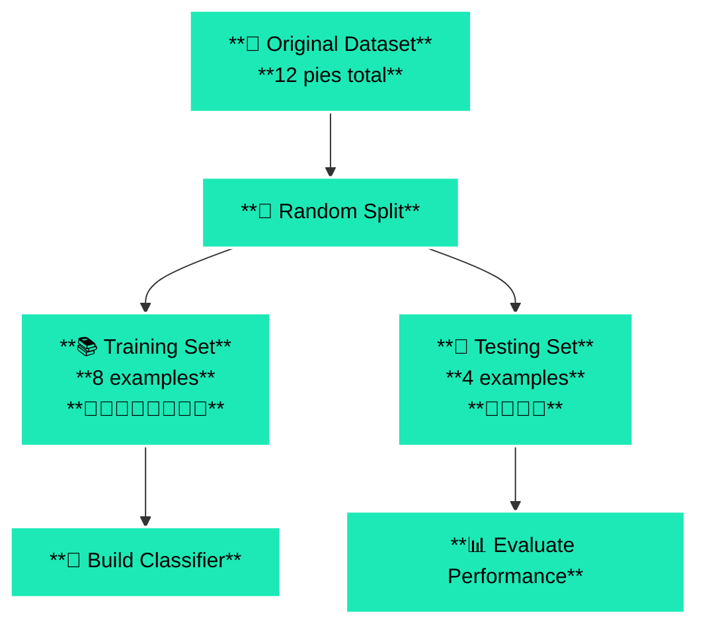
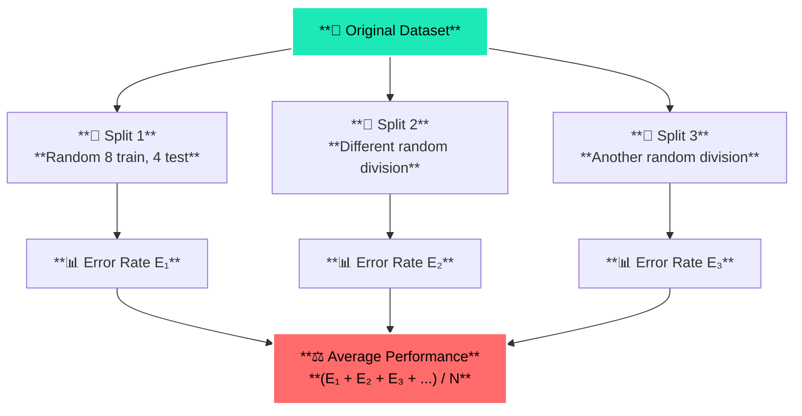
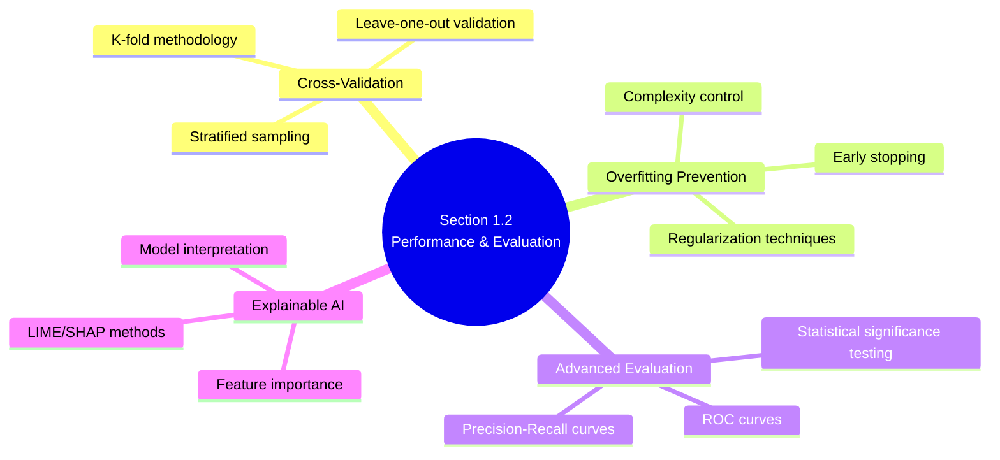

# 1.2 Expected Benefits of the Induced Classifier

# 🎯 Learning Objectives

By the end of this section, you will master:

✅ Performance estimation for unseen data

✅ Training/Testing set division strategies

✅ Random sub-sampling methodology

✅ Representativeness problems and solutions

✅ Classifier explanation requirements

✅ Combinatorial explosion in classifier space

# 📚 Core Concepts Deep Dive

## 🏗️ 1. The Real Goal of Machine Learning

**Definition:** We don't want to reclassify examples we already know - we want to predict the classes of future, unseen examples

💡 **Real-World Analogy:** Like teaching a doctor to diagnose diseases - we don't care if they can memorize the textbook cases, we care if they can diagnose new patients they've never seen before

## 🎯 Performance Estimation Problem

| **Performance Level** | **Error Rate** | **Typical Applications** |
| --- | --- | --- |
| **Excellent** | < 5% | Medical diagnosis, Safety systems |
| **Good** | 5-15% | Business applications, Recommendations |
| **Acceptable** | 15-25% | Exploratory analysis, Initial prototypes |

| Challenge | Impact |
| --- | --- |
| **How do we measure classifier performance on unseen data?** | Core evaluation challenge |
| **Training performance ≠ Real-world performance** | Critical insight for ML success |

## 🔄 2. Independent Testing Examples

## 📊 Training/Testing Set Division Strategy

**Concept:** Split your pre-classified examples into two separate groups:

| Set Type | Purpose | Usage |
| --- | --- | --- |
| **Training Set** | Build/induce the classifier | Learning phase |
| **Testing Set** | Evaluate classifier performance | Simulates future unseen data |

## 🎨 Visual Process Flow

| **Dataset Size** | **Recommended Split** | **Reasoning** |
| --- | --- | --- |
| **Small (< 1000)** | 70/30 or 80/20 | Preserve more training data |
| **Medium (1K-10K)** | 70/30 | Balanced approach |
| **Large (> 10K)** | 80/20 or 90/10 | More data for reliable testing |



## 📈 Example Performance Calculation

| Step | Details | Result |
| --- | --- | --- |
| **Training Phase** | 8 pies → build classifier | Learned patterns |
| **Testing Phase** | Test on 4 remaining pies | 3 out of 4 correct |
| **Performance** | Estimated accuracy | **75%** |

## ⚠️ 3. The Representativeness Problem

## 🚫 Why Random Splits Can Fail

**Issue:** A randomly chosen small training set might not represent the true concept

## 🦣 Real-World Example: Learning About Mammals

| Training Set Quality | Examples | Learned Concept | Outcome |
| --- | --- | --- | --- |
| **❌ Bad Training Set** | {Whale, Dolphin, Platypus} | "Mammals live in water and lay eggs" | **Wrong generalization** |
| **✅ Better Training Set** | {Dog, Cat, Horse, Cow, Whale, Platypus, Bat, Human} | Diverse mammal characteristics | **Correct understanding** |

## 🚗 Visual Analogy: Learning About Cars

**Bad Sample (Not Representative):**

- Training Set: 🏎️🏎️🏎️ (All sports cars)
- Learned Rule: "Cars are fast, expensive, and have 2 doors"
- Testing Set: 🚐🚗🚙🚓 (Family cars, SUVs, trucks)
- **Result: Classifier fails badly!**

**Good Sample (Representative):**

- Training Set: 🚗🚙🏎️🚐🚓 (Diverse car types)
- Learned Rule: More balanced understanding of "car" concept
- **Result: Better generalization!**

## 🔄 4. Random Sub-Sampling Solution

## 📊 The Methodology



## 🏥 Why This Works Better

| Approach | Analogy | Reliability |
| --- | --- | --- |
| **Single Split** | One doctor's diagnosis | Limited perspective |
| **Multiple Splits** | Multiple second opinions | More reliable average |

## 🏆 Algorithm Comparison Framework

| Algorithm | Average Error Rate | Performance Ranking |
| --- | --- | --- |
| **Algorithm A** | 15% | ✅ **Better** |
| **Algorithm B** | 23% | ❌ Worse |

**Conclusion:** Algorithm A is superior (lower error = better performance)

## 💭 5. Need for Explanations

## 🎯 Beyond Just Classification

**Problem:** Sometimes knowing the class isn't enough - we need to know **WHY**

## 🏥 Medical Example Comparison

| Approach | Example | Quality |
| --- | --- | --- |
| **❌ Insufficient** | "Computer says: Amputate the leg" | No reasoning |
| **✅ Better** | "Amputation recommended because: severe infection (high WBC), tissue death (MRI), failed antibiotics" | Clear justification |

## 🥧 Pie Example Explanation

| Level | Response | Value |
| --- | --- | --- |
| **Simple** | "Johnny will like this pie" | Basic classification |
| **Detailed** | "Circular pies with dark filling preferred (crispy texture), dark filling = poppy seeds (favorite), square + white = disliked" | **Actionable insights** |

## ⚖️ When Explanations Matter

| **Critical (Need Explanations)** | **Less Critical (Classification Sufficient)** |
| --- | --- |
| 🏥 Medical diagnosis and treatment | 📧 Email spam detection |
| 🏛️ Legal decisions (loan approval/rejection) | 🏷️ Image tagging |
| 🚗 Safety-critical systems (autonomous driving) | 🎬 Movie recommendations |
| 💰 Financial recommendations | 🎵 Music playlist generation |

## 💥 6. The Combinatorial Explosion Problem

## 🤯 Alternative Solutions Dilemma

**Shocking Reality:** In the pie example, there are **2⁹⁶** different classifiers that all perfectly classify the 12 training examples!

## 🧮 The Mathematics

| Component | Count | Impact |
| --- | --- | --- |
| **Known Examples** | 12 pies (training set) | Fixed classifications |
| **Unknown Examples** | 96 pies (remaining instance space) | Each can be ± |
| **Classification Possibilities** | 2 per unknown example | Exponential growth |
| **Total Classifiers** | **2⁹⁶ = 79,228,162,514,264,337,593,543,950,336** | **Astronomical!** |

## 🎭 Visual Representation

```
🎯 The Same Training Data Can Lead To Vastly Different Classifiers:

Training Set (12 examples): ✅✅✅✅✅✅✅✅✅✅✅✅ ← All classifiers agree

Unknown Examples (96 pies): 
Classifier A: ✅❌❌❌❌❌❌❌❌❌❌❌❌❌❌❌...
Classifier B: ✅✅❌❌❌❌❌❌❌❌❌❌❌❌❌❌...  
Classifier C: ❌❌❌❌❌❌❌❌❌❌❌❌❌❌❌❌...
... 2^96 different possibilities!
```

## 🍽️ Real-World Analogy: Restaurant Preferences

| Scenario Element | Details | Complexity |
| --- | --- | --- |
| **Known Data** | John likes 12 specific restaurants | Fixed preferences |
| **Unknown Space** | 1000 restaurants in the city | Vast possibilities |
| **Pattern Possibilities** | Different "John's preference patterns" | **2¹⁰⁰⁰ possibilities!** |

## ⚠️ Why This Is Problematic

**The Issue:** Perfect training performance doesn't guarantee good testing performance

**Critical Implication:**

- ✅ Correctly classifies all 12 training pies
- ❌ Incorrectly classifies most future pies

# 🌍 Real-World Applications

## 📊 Performance Evaluation Systems

## 🏥 Medical Diagnostic Validation

- **Training Set:** Historical patient records with known diagnoses
- **Testing Set:** New patients for validation
- **Challenge:** Ensuring diagnostic accuracy on unseen cases

## 📈 Financial Risk Assessment

- **Training Set:** Historical loan data with default outcomes
- **Testing Set:** New loan applications
- **Challenge:** Predicting default risk for new applicants

## 🤖 AI System Deployment

- **Training Set:** Development phase data
- **Testing Set:** Real-world deployment scenarios
- **Challenge:** Maintaining performance in production

# 🎯 Control Questions & Detailed Answers

## Q1: How can we estimate the error rate on examples that have not been seen during learning? What is random sub-sampling?

## 📊 Error Rate Estimation Process:

1. **Split data** into training and testing sets
2. **Build classifier** on training set only
3. **Evaluate performance** on testing set (simulates unseen data)
4. **Testing error rate** estimates future performance

## 🔄 Random Sub-sampling Methodology:

| Step | Process | Benefit |
| --- | --- | --- |
| **Iteration 1** | Random train/test split → Error E₁ | Single estimate |
| **Iteration 2** | Different random division → Error E₂ | Additional perspective |
| **Iteration N** | Repeat process → Error Eₙ | Multiple viewpoints |
| **Final Result** | Average all error rates | **Reliable estimate** |

## Q2: Why is error rate usually higher on the testing set than on the training set?

## 🧠 Fundamental Reasons:

| Phenomenon | Explanation | Real-World Analogy |
| --- | --- | --- |
| **Overfitting** | Classifier memorizes training examples | Student memorizing textbook answers |
| **Training Exposure** | Classifier has "seen" these examples | Practicing with known problems |
| **Testing Challenge** | Encounters completely new examples | Taking exam with new problems |

## 📊 Statistical Reality:

**Training error ≤ Testing error** (classifier is optimized for training data)

## Q3: Give examples where classifiers need explanations vs. where they don't.

## 🚨 Explanations REQUIRED:

| Domain | Example | Why Explanation Needed |
| --- | --- | --- |
| **🏥 Medical** | "Pneumonia diagnosis: chest X-ray fluid + fever (102°F) + breathing difficulty + high WBC" | **Life-critical decisions** |
| **🏛️ Legal** | "Loan denied: insufficient income (65% debt ratio) + poor credit (3 missed payments) + low collateral" | **Legal compliance** |

## ✅ Explanations OPTIONAL:

| Domain | Example | Why Classification Sufficient |
| --- | --- | --- |
| **🎵 Entertainment** | "You might like this song" | **User convenience** |
| **🏷️ Automation** | "This image contains a cat" | **Automated organization** |

## Q4: What do we mean by "combinatorial number of classifiers"?

## 🧮 Combinatorial Explosion Explained:

| Component | Constraint | Variation |
| --- | --- | --- |
| **Training examples** | Fixed classifications (must match) | **No variation** |
| **Unknown examples** | Each can be + OR - | **2 choices each** |
| **N unknown examples** | Independent classification | **2ᴺ total combinations** |

## 🥧 Pie Domain Application:

- **96 unknown examples** → **2⁹⁶ possible classifiers**
- **Key Insight:** Many radically different classifiers can have identical training performance but vastly different real-world performance

# 💡 Key Insights & Personal Understanding

## 🎯 The Generalization Challenge

## Core ML Problem Matrix:

| Challenge | Impact | Solution Approach |
| --- | --- | --- |
| **Limited training data** | May not capture full concept complexity | Diverse, representative sampling |
| **Perfect training performance** | Can mask poor generalization | Independent testing evaluation |
| **Exponential classifier space** | Many equally valid training solutions | Principled selection criteria |

## ⚖️ The Evaluation Imperative

## Critical Guidelines:

- ❌ **Never trust training performance alone**
- ✅ **Always evaluate on independent test data**
- 🔄 **Use multiple train/test splits for reliability**
- 📊 **Understand that testing error > training error is normal**

## 🎭 The Explanation Trade-off

| Algorithm Type | Interpretability | Performance | Use Case |
| --- | --- | --- | --- |
| **Simple (Boolean expressions)** | ✅ High | ⚖️ Moderate | Regulated industries |
| **Complex (Deep neural networks)** | ❌ Low | ✅ High | Performance-critical tasks |

# 🔗 Connections to Future Learning



# ❓ Questions for Later Exploration

- **🎯 How do we choose the optimal train/test split ratio?**
- **📈 What's the relationship between training set size and generalization?**
- **⚖️ How do we balance model complexity vs. explainability?**
- **🔬 What are more sophisticated evaluation methods beyond simple train/test splits?**
- **🎲 How do we ensure statistical significance in performance comparisons?**
- **🌍 How do we evaluate classifier performance in real-world deployment scenarios?**