# 1.3 Problems with Available Data

# 🎯 Learning Objectives

By the end of this section, you will master:

✅ Origin and creation methods of training examples

✅ Different types of attributes (discrete, numeric, continuous)

✅ Attribute problems: irrelevant, missing, and redundant attributes

✅ Missing attribute values and their impact

✅ Types of noise in data and their sources

✅ Class-label noise and inconsistent training sets

# 📚 Core Concepts Deep Dive

## 🏗️ 1. Origin of Training Examples

**Definition:** Training examples can be created through various methods, each with different quality and reliability characteristics

💡 **Real-World Analogy:** Like gathering evidence for a court case - you can have expert witnesses (manual creation), surveillance footage (automated extraction), or a combination of sources

## 📊 Training Example Creation Methods

| Method | Description | Example | Quality Level |
| --- | --- | --- | --- |
| **Manual Creation** | Expert prepares and labels examples | Medical expert diagnosing diseases from symptoms | ✅ **High** |
| **Automated Extraction** | Program extracts from database | Employee database → predicting job departure | ⚖️ **Medium** |
| **Expert + Automated** | Combination of both approaches | Database extraction + expert validation | ✅ **High** |
| **Multi-Database Fusion** | Combining multiple data sources | Hospital records + lab results + patient surveys | ⚠️ **Variable** |

## 🏢 Employee Departure Prediction Example

**Company Challenge:** A tech company notices 25% annual turnover and wants to predict which employees are likely to leave within the next 12 months to enable proactive retention strategies.

**Available Data Source:** HR database with 5 years of historical employee records (10,000+ employees)

## 🔍 **Detailed Attribute Extraction Process**

| **Database Field** | **Extracted Attribute** | **Processing Logic** | **Example Values** |
| --- | --- | --- | --- |
| **Employee Address** | `commute_distance` | Calculate miles from office using GPS coordinates | 5.2 miles, 28.7 miles, 45.1 miles |
| **Gender** | `gender` | Direct categorical extraction | Male, Female, Non-binary |
| **Marital Status** | `marital_status` | Direct categorical extraction | Single, Married, Divorced |
| **Job Function** | `department`, `job_level` | Parse job title and hierarchy | "Software Engineer III" → {Engineering, Level 3} |
| **Salary History** | `salary_growth_rate`, `recent_raise` | Calculate % increase over past 2 years | 15% growth, Last raise: 8 months ago |
| **Promotion Data** | `time_since_promotion`, `promotion_frequency` | Time analysis of career progression | 18 months since last promotion |

## 🏷️ **Label Generation Logic**

**Step-by-Step Labeling Process:**

```
For each employee record:
1. Check employment status as of data extraction date
2. If employee left company:
   - Calculate time between last database update and departure
   - If departure ≤ 12 months: Label = "POSITIVE" (will leave)
   - If departure > 12 months: Label = "NEGATIVE" (will stay)
3. If employee still with company:
   - If record is ≥ 12 months old: Label = "NEGATIVE" (stayed)
   - If record is < 12 months old: Exclude from training (unknown outcome)
```

## 📈 **Concrete Example Records**

| **Employee ID** | **Attributes** | **Departure Date** | **Label Logic** | **Final Label** |
| --- | --- | --- | --- | --- |
| **EMP001** | Distance: 35mi, Gender: F, Married, Engineering L2, 5% growth, No promotion 2yrs | Left 8 months after record | 8 months ≤ 12 months | **POSITIVE** |
| **EMP002** | Distance: 8mi, Gender: M, Single, Sales L3, 22% growth, Promoted 6mo ago | Left 18 months after record | 18 months > 12 months | **NEGATIVE** |
| **EMP003** | Distance: 15mi, Gender: F, Divorced, HR L1, -2% growth, No promotion 3yrs | Still employed after 2 years | Stayed beyond prediction window | **NEGATIVE** |

## 🎯 **Training Set Creation Workflow**

```mermaid
flowchart TD
    A["**📊 HR Database**<br>**50,000 employee records**<br>**5 years historical data**"]
    B["**🔄 Data Processing**<br>**Extract attributes**<br>**Calculate derived features**"]
    C["**⏰ Temporal Filtering**<br>**Only records with known 12-month outcome**"]
    D["**🏷️ Label Assignment**<br>**POSITIVE: Left within 12 months**<br>**NEGATIVE: Stayed 12+ months**"]
    E["**📋 Final Training Set**<br>**8,500 labeled examples**<br>**2,100 POSITIVE (25%)**<br>**6,400 NEGATIVE (75%)**"]

    A --> B
    B --> C
    C --> D
    D --> E

    style A fill:#1de9b6,stroke:#fff,stroke-width:2px,color:#000
    style B fill:#1de9b6,stroke:#fff,stroke-width:2px,color:#000
    style C fill:#ffd93d,stroke:#fff,stroke-width:2px,color:#000
    style D fill:#ff9f43,stroke:#fff,stroke-width:2px,color:#000
    style E fill:#ff6b6b,stroke:#fff,stroke-width:2px,color:#000
```



## 🔢 2. Different Types of Attributes

## 📊 Attribute Classification System

| Attribute Type | Description | Value Range | Examples |
| --- | --- | --- | --- |
| **🎯 Discrete** | Limited set of distinct values | 2-10 typically | Shape: {circle, square, triangle} |
| **📊 Numeric** | Integer numbers | Whole numbers | Age: 23, Children: 2 |
| **📈 Continuous** | Real numbers from continuous domain | Any decimal value | Price: 2.35, Weight: 68.7kg |

## **Why "2-10 typically" Makes Sense:**

| **Range** | **Reason** | **ML Impact** |
| --- | --- | --- |
| **< 2 values** | Not useful (no variation to learn from) | **Useless for classification** |
| **2-10 values** | ✅ **Optimal for most ML algorithms** | **Easy to process, meaningful patterns** |
| **> 10 values** | Can work but creates complexity | **May need special handling** |

## 🥧 Pie Domain Attribute Analysis

| Attribute | Type | Possible Values | Reasoning |
| --- | --- | --- | --- |
| **Shape** | 🎯 Discrete | {circle, triangle, square} | Fixed geometric categories |
| **Crust-size** | 🎯 Discrete | {thin, thick} | Binary thickness choice |
| **Filling-shade** | 🎯 Discrete | {white, gray, dark} | Categorical color options |
| **Price** | 📈 Continuous | $1.50, $2.35, $4.99 | Any monetary value |
| **Weight** | 📈 Continuous | 250.5g, 180.2g, 310.8g | Precise measurements |

## 🌍 Real-World Attribute Examples

**🏥 Medical Domain:**

- **Discrete:** Blood type {A, B, AB, O}, Gender {Male, Female}
- **Numeric:** Age = 45, Children = 3
- **Continuous:** Blood pressure = 120.5, Temperature = 98.6°F

**🏪 E-commerce Domain:**

- **Discrete:** Category {Electronics, Clothing, Books}, Brand names
- **Numeric:** Quantity = 5, Rating = 4
- **Continuous:** Price = $29.99, Weight = 1.2kg

## ⚠️ 3. Irrelevant Attributes

**Definition:** Attributes that have no meaningful relationship with the target concept being learned

💡 **Real-World Analogy:** Like including the weather in Tokyo when predicting pizza sales in New York - completely unrelated information that adds confusion

## 🚫 Why Irrelevant Attributes Are Problematic

| Problem | Impact | Example |
| --- | --- | --- |
| **Computational Cost** | Slower training and prediction | Processing 1000 attributes when only 10 matter |
| **Misleading Patterns** | Classifier learns false correlations | Predicting pie preference based on cook's shoe size |
| **Overfitting Risk** | Model memorizes noise instead of signal | Perfect accuracy on training, poor on testing |
| **Interpretability Loss** | Harder to understand what matters | Cannot explain why decisions are made |

## 🎯 Sources of Irrelevant Attributes

**📝 Manual Creation:**

- **Expert uncertainty** → Includes "suspected but not guaranteed" attributes
- **Over-caution** → "Better safe than sorry" approach
- **Domain complexity** → Difficulty knowing what truly matters

**🤖 Automated Extraction:**

- **Database design mismatch** → Databases created for different purposes
- **Information overload** → Tiny relevant portion in vast data ocean
- **Unknown relevance** → No clear understanding of what matters

## 🏥 Medical Diagnosis Example

| Relevant Attributes | Irrelevant Attributes | Why Irrelevant |
| --- | --- | --- |
| **Symptoms, Test results, Medical history** | **Patient's favorite color** | No medical significance |
| **Age, Gender, Genetics** | **Hospital parking space number** | Administrative artifact |
| **Vital signs, Lab values** | **Doctor's coffee preference** | Personal characteristic |

## 🕳️ 4. Missing Attributes

**Definition:** Critical attributes that should influence the decision but are completely absent from the training data

💡 **Real-World Analogy:** Like trying to predict movie success without knowing the budget - a crucial factor that's completely missing from your analysis

## ⚖️ Missing Attributes Impact Analysis

| Scenario | Missing Attribute | Consequence | Solution Approach |
| --- | --- | --- | --- |
| **Johnny's Pies** | Price | Can't distinguish budget preferences | Add price data or segment by price |
| **Medical Diagnosis** | Genetic history | Misses hereditary disease risks | Family history questionnaire |
| **Employee Departure** | Job satisfaction | Ignores key motivational factor | Employee surveys |
| **Credit Approval** | Income verification | Cannot assess repayment ability | Require income documentation |

## 🔴 Inconsistent Training Set Problem

**Definition:** When two examples have identical attribute values but different class labels due to missing critical attributes

**Mathematical Representation:**

```
Example A: {shape=circle, crust=thick, filling=dark} → Positive (Johnny likes)
Example B: {shape=circle, crust=thick, filling=dark} → Negative (Johnny dislikes)

Hidden factor: Price
Example A: Price = $2.00 (affordable)
Example B: Price = $12.00 (expensive)
```

## 🎯 Why Missing Attributes Cause Problems

```mermaid
flowchart TD
    A["**🎯 Identical Attribute Values**<br>**Same description**"]
    B["**❓ Hidden Critical Factor**<br>**Missing attribute**"]
    C["**🔴 Different Class Labels**<br>**Conflicting examples**"]
    D["**💥 Inconsistent Training Set**<br>**Classifier confusion**"]
    E["**📉 Poor Performance**<br>**Unable to learn pattern**"]

    A --> C
    B --> C
    C --> D
    D --> E

    style A fill:#1de9b6,stroke:#fff,stroke-width:2px,color:#000
    style B fill:#ffd93d,stroke:#fff,stroke-width:2px,color:#000
    style C fill:#ff6b6b,stroke:#fff,stroke-width:2px,color:#000
    style D fill:#ff6b6b,stroke:#fff,stroke-width:2px,color:#000
    style E fill:#ff6b6b,stroke:#fff,stroke-width:2px,color:#000
```



## 🔄 5. Redundant Attributes

**Definition:** Attributes whose values can be calculated or derived from other attributes in the dataset

💡 **Real-World Analogy:** Like having both a person's birth date and their age in years - one can be calculated from the other plus today's date

## 📊 Types of Redundant Attributes

| Redundancy Type | Example | Relationship | Impact |
| --- | --- | --- | --- |
| **Mathematical** | Birth date + Age | Age = Today - Birth date | ⚖️ **Low** risk |
| **Logical** | Married + Single | Single = NOT Married | ⚖️ **Low** risk |
| **Derived** | Income + Tax bracket | Tax bracket = f(Income) | ⚖️ **Low** risk |
| **Duplicate** | Address1 + Address2 (same) | Identical information | ⚖️ **Low** risk |

## ✅ Why Redundant Attributes Are Less Dangerous

| Aspect | Impact | Reasoning |
| --- | --- | --- |
| **Information Content** | No loss of critical information | Same signal, different format |
| **Pattern Recognition** | Classifier can still learn correctly | Multiple paths to same conclusion |
| **Computational Cost** | Slightly higher processing | More attributes to process |
| **Storage Requirements** | Additional memory usage | Duplicate information stored |

## 🏥 Medical Database Example

**Redundant Attributes:**

- **Birth Date:** 1985-03-15
- **Age:** 40 years
- **Age in Months:** 480 months

**Better Approach:** Keep birth date only, calculate age as needed

## 🕳️ 6. Missing Attribute Values

**Definition:** Known attributes exist in the dataset schema, but specific values are unknown for some examples

💡 **Real-World Analogy:** Like a survey where some questions are left blank - you know what you wanted to ask, but not everyone provided answers

## 📊 Missing Values Pattern Analysis

| Missing Pattern | Description | Example | Handling Strategy |
| --- | --- | --- | --- |
| **Random Missing** | Values missing without pattern | Random survey non-responses | Mean/mode imputation |
| **Systematic Missing** | Pattern to missing values | Only wealthy patients get expensive tests | Domain-specific imputation |
| **Structural Missing** | Logically cannot have value | Pregnancy test for male patients | Conditional logic |

## 🏥 Hospital Database Example

| Patient | Blood Pressure | Cholesterol | Pregnancy Test | Age |
| --- | --- | --- | --- | --- |
| **Patient A (F, 25)** | 120/80 | ❓ Missing | Negative | 25 |
| **Patient B (M, 45)** | ❓ Missing | 220 | N/A | 45 |
| **Patient C (F, 60)** | 140/90 | 180 | N/A | ❓ Missing |

## 🔧 Missing Value Handling Strategies

| Strategy | When to Use | Pros | Cons |
| --- | --- | --- | --- |
| **Delete Examples** | Small % missing, large dataset | Simple, clean data | Loss of information |
| **Mean/Mode Imputation** | Numerical/categorical random missing | Preserves dataset size | May bias toward average |
| **Forward Fill** | Time series data | Logical progression | Not suitable for all domains |
| **Model-Based** | Complex patterns | Most accurate | Computationally expensive |

# 📢 7. Attribute-Value Noise

**Definition:** Errors, inaccuracies, or distortions in the recorded values of input features/attributes, while the class labels remain correct

💡 **Real-World Analogy:** Like looking at objects through dirty glasses - you can still see what they are (correct labels), but the details are blurry or distorted (noisy attributes)

## 🎯 **Core Concept Visualization**



```mermaid
flowchart TD
    A["**✅ True Reality**<br>**Patient temp: 99.5°F**<br>**Diagnosis: Fever**"]
    B["**🔧 Attribute-Value Noise**<br>**Recorded temp: 99.1°F**<br>**Diagnosis: Fever** ✅"]
    C["**📊 Impact Assessment**<br>**Slightly modified input**<br>**Correct teaching signal**"]
    D["**🎯 Learning Outcome**<br>**Classifier learns with minor blur**<br>**Still recognizes fever patterns**"]

    A --> B
    B --> C
    C --> D

    style A fill:#1de9b6,stroke:#fff,stroke-width:2px,color:#000
    style B fill:#ffd93d,stroke:#fff,stroke-width:2px,color:#000
    style C fill:#ff9f43,stroke:#fff,stroke-width:2px,color:#000
    style D fill:#1de9b6,stroke:#fff,stroke-width:2px,color:#000
```

## 🔍 **Three Types of Attribute-Value Noise**

## **🎲 Type 1: Stochastic Noise (Random)**

**Definition:** Unpredictable variations that occur without systematic pattern

| **Source Category** | **Specific Example** | **Real Impact** | **Detection Method** |
| --- | --- | --- | --- |
| **Natural Variation** | Body weight: 68.2kg (morning) vs 68.7kg (evening) | ⚖️ **Manageable** | Statistical analysis of repeated measurements |
| **Measurement Error** | Digital thermometer ±0.1°C precision | ⚖️ **Manageable** | Manufacturer specifications |
| **Human Error** | Nurse records BP as 120/80 instead of 125/80 | ⚠️ **Moderate** | Cross-validation with other nurses |
| **Environmental** | Humidity affects electronic scale readings | ⚖️ **Manageable** | Environmental monitoring |

**🥧 Pie Domain Example:**

```
True: {shape=circle, crust=thick, filling=dark} → Positive
Noisy: {shape=circle, crust=thick, filling=gray} → Positive ✅
Problem: Filling shade slightly wrong due to lighting conditions
Impact: Minor - classifier still learns "circular pies are preferred"
```

## **📐 Type 2: Systematic Noise (Consistent Bias)**

**Definition:** Consistent errors that affect all measurements in the same predictable way

| **Source Category** | **Specific Example** | **Real Impact** | **Correction Strategy** |
| --- | --- | --- | --- |
| **Calibration Error** | All thermometers read 2°F too low | ✅ **Correctable** | Add 2°F to all readings |
| **Unit Confusion** | Height recorded in inches vs centimeters | ✅ **Correctable** | Standard unit conversion |
| **Time Drift** | Blood pressure cuff loses calibration over months | ⚠️ **Moderate** | Regular recalibration schedule |
| **Operator Bias** | Technician consistently rounds up measurements | ⚠️ **Moderate** | Training and protocols |

**🏥 Medical Example:**

```
Scenario: Hospital scale consistently reads 2kg too heavy
True weight: 70kg → Recorded: 72kg (for ALL patients)
Impact: Systematic but learnable - classifier adapts to consistent offset
Solution: Discover pattern and correct retrospectively
```

## **💥 Type 3: Arbitrary Artifacts**

**Definition:** Complete corruption where recorded values bear no relation to reality

| **Source Category** | **Specific Example** | **Real Impact** | **Detection Method** |
| --- | --- | --- | --- |
| **Equipment Failure** | EEG electrode loose → all readings = 0 | 🔴 **Critical** | Obvious outlier detection |
| **Data Corruption** | Hard drive failure corrupts random values | 🔴 **Critical** | Checksum validation |
| **Communication Error** | Network timeout → default value inserted | 🔴 **Critical** | Data transmission logs |

**🚨 Critical Example:**

```
Normal EEG reading: {alpha_waves=8.5, beta_waves=12.3, theta_waves=4.2}
Artifact corruption: {alpha_waves=0, beta_waves=0, theta_waves=0}
Impact: Completely wrong input but diagnosis label still correct
Detection: Obvious - all zeros is impossible for living patient
```

## 📊 **Attribute-Value Noise Impact Matrix**

| **Noise Level** | **Learning Impact** | **Performance Drop** | **Mitigation Strategy** |
| --- | --- | --- | --- |
| **Low (< 5%)** | 📈 Minimal degradation | -2% to -5% | ✅ Ignore or light filtering |
| **Medium (5-15%)** | ⚖️ Noticeable blur | -5% to -15% | 🔧 Statistical preprocessing |
| **High (15-30%)** | ⚠️ Significant confusion | -15% to -25% | 🛠️ Robust algorithms needed |
| **Extreme (> 30%)** | 💥 Severe corruption | -25%+ | 🚨 Data collection review required |

# 🏷️ 8. Class-Label Noise

**Definition:** Errors in the target class assignments where examples are assigned incorrect labels, while the attribute values are accurate

💡 **Real-World Analogy:** Like having a teacher who shows you correct examples but gives you the wrong answers - you're getting contradictory teaching signals that fundamentally confuse the learning process

## 🎯 **Core Concept Visualization**



```mermaid
flowchart TD
    A["**✅ True Reality**<br>**Patient symptoms: Fever, cough, fatigue**<br>**True condition: Pneumonia**"]
    B["**🏷️ Class-Label Noise**<br>**Recorded symptoms: Fever, cough, fatigue** ✅<br>**Recorded diagnosis: Healthy** ❌"]
    C["**💥 Contradiction Impact**<br>**Perfect input description**<br>**Completely wrong teaching signal**"]
    D["**🌀 Learning Disaster**<br>**Classifier learns: Fever + cough = Healthy**<br>**Applies wrong pattern to future patients**"]

    A --> B
    B --> C
    C --> D

    style A fill:#1de9b6,stroke:#fff,stroke-width:2px,color:#000
    style B fill:#ff6b6b,stroke:#fff,stroke-width:2px,color:#000
    style C fill:#ff6b6b,stroke:#fff,stroke-width:2px,color:#000
    style D fill:#ff6b6b,stroke:#fff,stroke-width:2px,color:#000
```

## 🔍 **Three Types of Class-Label Noise**

## **🎲 Type 1: Stochastic Class-Label Noise (Random)**

**Definition:** Random mistakes in label assignment without systematic pattern

| **Source Category** | **Specific Example** | **Real Impact** | **Detection Method** |
| --- | --- | --- | --- |
| **Recording Errors** | Data entry mistake: Positive typed as Negative | 🔴 **High** | Duplicate labeling comparison |
| **Gray Area Cases** | Borderline tumor: benign vs malignant uncertainty | 🔴 **High** | Multiple expert opinions |
| **Expert Fatigue** | Doctor makes mistake after 12-hour shift | 🔴 **High** | Fresh expert review |
| **Ambiguous Cases** | Email: spam vs promotional (borderline) | ⚖️ **Medium** | Consensus labeling |

**🥧 Pie Domain Example:**

```
Attributes: {shape=circle, crust=thick, filling=dark} → Should be Positive
Label Error: Marked as Negative due to data entry mistake
Disaster: Classifier learns "dark-filled circles are disliked"
Propagation: All future dark-filled circles predicted incorrectly
```

## **📐 Type 2: Systematic Class-Label Noise (Consistent Bias)**

**Definition:** Consistent bias in labeling that affects examples in a predictable pattern

| **Source Category** | **Specific Example** | **Real Impact** | **Detection Method** |
| --- | --- | --- | --- |
| **Conservative Bias** | Doctor avoids diagnosing rare diseases | 🔴 **Critical** | Statistical analysis of diagnosis patterns |
| **Economic Pressure** | Insurance company bias toward denying claims | 🔴 **Critical** | Audit of approval/denial rates |
| **Risk Aversion** | Bank consistently rejects borderline loan applications | 🔴 **Critical** | Demographic bias analysis |
| **Time Pressure** | Radiologist defaults to "normal" when rushed | 🔴 **Critical** | Review of reading times vs diagnoses |

**🏥 Medical Systematic Bias:**

```
Pattern: Young doctors reluctant to diagnose heart disease in 30-year-olds
Effect: 90% of actual heart disease cases in young adults labeled as "anxiety"
Learning Disaster: Classifier learns "young age + chest pain = anxiety"
Real World Impact: Missing heart attacks in young patients
```

## **💥 Type 3: Arbitrary Artifacts in Labels**

**Definition:** Complete label corruption where assigned classes bear no relation to reality

| **Source Category** | **Specific Example** | **Real Impact** | **Detection Method** |
| --- | --- | --- | --- |
| **System Failure** | Database crash during update → random labels | 🔴 **Catastrophic** | Data integrity checks |
| **File Corruption** | Wrong label file merged with data | 🔴 **Catastrophic** | File hash verification |
| **Process Error** | Labels from different dataset accidentally used | 🔴 **Catastrophic** | Cross-reference validation |

**🚨 Catastrophic Example:**

```
Original: Medical X-rays with pneumonia/healthy labels
Corruption: Accidentally merged with cat/dog image labels  
Result: Chest X-ray showing pneumonia labeled as "dog"
Impact: Classifier completely fails - learns nonsense patterns
```

## ⚔️ **Direct Comparison: Attribute vs. Class-Label Noise**

## **🏥 Medical Diagnosis: Real-World Comparison**

**Scenario:** Pneumonia detection system with 10% noise

| **Noise Type** | **Example** | **Learning Impact** | **Future Predictions** |
| --- | --- | --- | --- |
| **Attribute Noise** | Temperature 101°F recorded as 100.2°F, label=pneumonia ✅ | Learns slightly blurred fever threshold | Still recognizes pneumonia patterns |
| **Label Noise** | Temperature 101°F recorded correctly, label=healthy ❌ | **Learns high fever = healthy** | **Misses pneumonia in future fever cases** |

## **📊 Performance Impact Comparison**

**Test Dataset: 1,000 medical cases with 10% noise**

| **Metric** | **Clean Data** | **10% Attribute Noise** | **10% Label Noise** | **Impact Difference** |
| --- | --- | --- | --- | --- |
| **Accuracy** | 95% | 89% (-6%) | **74% (-21%)** | **Label noise 3.5x worse** |
| **Precision** | 92% | 86% (-6%) | **68% (-24%)** | **Label noise 4x worse** |
| **Recall** | 94% | 88% (-6%) | **65% (-29%)** | **Label noise 5x worse** |
| **F1 Score** | 93% | 87% (-6%) | **66% (-27%)** | **Label noise 4.5x worse** |

## ⚖️ **Complete 6-Way Comparison Matrix**

## **🎲 Stochastic (Random) Noise Types**

| **Comparison Aspect** | **🔧 Stochastic Attribute Noise** | **🏷️ Stochastic Label Noise** | **Relative Impact** |
| --- | --- | --- | --- |
| **Definition** | Random errors in input values | Random errors in class assignments | **Label 3x worse** |
| **Example** | Temperature 99.5°F → recorded as 99.1°F | Pneumonia patient → labeled as "Healthy" | **Label catastrophic** |
| **Pattern Learning** | ✅ Learns correct pattern with blur | ❌ **Learns contradictory patterns** | **Label devastating** |
| **Detection** | 📊 Statistical outlier detection | 🧠 **Requires expert validation** | **Attribute easier** |
| **Correction Cost** | 💲 Low (averaging, filtering) | 💲💲💲 **High (expert re-review)** | **Label 5x expensive** |
| **Future Impact** | 📈 Slightly reduced accuracy | 💥 **Systematically wrong predictions** | **Label spreads error** |

## **📐 Systematic (Biased) Noise Types**

| **Comparison Aspect** | **🔧 Systematic Attribute Noise** | **🏷️ Systematic Label Noise** | **Relative Impact** |
| --- | --- | --- | --- |
| **Definition** | Consistent bias in measurements | Consistent bias in labeling decisions | **Label 5x worse** |
| **Example** | All thermometers read 2°F too low | Doctor consistently avoids rare disease diagnosis | **Label creates blind spots** |
| **Pattern Learning** | ✅ Learns with consistent offset | ❌ **Learns systematically wrong patterns** | **Label teaches wrong rules** |
| **Detection** | 📊 Calibration/comparison analysis | 📈 **Statistical bias analysis** | **Both detectable, label harder** |
| **Correction** | ⚡ Mathematical adjustment (+2°F) | 👨⚕️ **Requires retraining experts** | **Attribute easy fix** |
| **Predictability** | ✅ Highly predictable pattern | ✅ Predictable but **dangerous** | **Both predictable, label harmful** |

## **💥 Arbitrary Artifacts Types**

| **Comparison Aspect** | **🔧 Arbitrary Attribute Artifacts** | **🏷️ Arbitrary Label Artifacts** | **Relative Impact** |
| --- | --- | --- | --- |
| **Definition** | Complete corruption of input values | Complete corruption of class labels | **Label 10x worse** |
| **Example** | EEG electrode loose → all readings = 0 | Database crash → random labels assigned | **Label creates nonsense learning** |
| **Pattern Learning** | ⚖️ Obvious outliers, still some learning | 🚫 **Complete learning failure** | **Label kills learning** |
| **Detection** | ✅ Very obvious (impossible values) | ✅ **Obvious but catastrophic** | **Both obvious, label catastrophic** |
| **Correction** | 🔧 Remove/ignore corrupted examples | 🚨 **Complete re-labeling required** | **Label requires total restart** |
| **Urgency** | ⚠️ High priority to fix | 🚨 **Emergency - stop training immediately** | **Label critical priority** |

## **📊 Cross-Type Impact Severity Matrix**

| **Noise Sub-Type** | **Learning Disruption** | **Detection Difficulty** | **Correction Cost** | **Overall Danger Score** |
| --- | --- | --- | --- | --- |
| **🎲 Stochastic Attribute** | Low (2/10) | Easy (8/10) | Low (2/10) | **4/10** |
| **📐 Systematic Attribute** | Medium (4/10) | Medium (6/10) | Low (3/10) | **4.3/10** |
| **💥 Arbitrary Attribute** | Medium (5/10) | Easy (9/10) | Medium (4/10) | **6/10** |
| **🎲 Stochastic Label** | High (8/10) | Hard (3/10) | High (8/10) | **6.3/10** |
| **📐 Systematic Label** | Very High (9/10) | Medium (5/10) | Very High (9/10) | **7.7/10** |
| **💥 Arbitrary Label** | Critical (10/10) | Easy (8/10) | Critical (10/10) | **9.3/10** |

## **🎯 Key Pattern Recognition:**

- **Same pattern types** (stochastic, systematic, arbitrary) affect learning differently based on location
- **Label corruption is consistently 3-10x more dangerous** than corresponding attribute corruption
- **Arbitrary artifacts** are most extreme in both categories, but label artifacts are catastrophic

## 🏆 **Danger Ranking: All 6 Sub-Types**

## **📈 From Least to Most Dangerous:**

1. **🥉 Stochastic Attribute Noise (Score: 4/10)**
    - Easy to detect, cheap to fix, minimal learning impact
    - *Strategy*: Statistical filtering, ensemble methods
2. **🥈 Systematic Attribute Noise (Score: 4.3/10)**
    - Predictable pattern, mathematical correction possible
    - *Strategy*: Calibration, bias correction algorithms
3. **🏅 Arbitrary Attribute Artifacts (Score: 6/10)**
    - Obvious to spot, moderate impact when removed
    - *Strategy*: Outlier detection, data validation
4. **⚠️ Stochastic Label Noise (Score: 6.3/10)**
    - Hard to detect, expensive to fix, confuses boundaries
    - *Strategy*: Multi-expert labeling, consensus voting
5. **🚨 Systematic Label Noise (Score: 7.7/10)**
    - Creates systematic blind spots in learning
    - *Strategy*: Bias audits, expert retraining
6. **💀 Arbitrary Label Artifacts (Score: 9.3/10)**
    - **MOST DANGEROUS** - Completely destroys learning
    - *Strategy*: Emergency stop, complete re-labeling

## 🛡️ **Detection and Mitigation Strategies**

## **🔧 For Attribute-Value Noise:**

| **Strategy** | **Effectiveness** | **Implementation** | **Cost** |
| --- | --- | --- | --- |
| **Statistical Outlier Detection** | ✅ High | Automated Z-score analysis | 💲 Low |
| **Sensor Calibration** | ✅ Very High | Regular equipment maintenance | 💲💲 Medium |
| **Cross-Validation** | ✅ Good | Multiple measurement sources | 💲💲 Medium |
| **Robust Algorithms** | ✅ Good | Use noise-resistant methods | 💲 Low |

## **🏷️ For Class-Label Noise:**

| **Strategy** | **Effectiveness** | **Implementation** | **Cost** |
| --- | --- | --- | --- |
| **Multi-Expert Labeling** | ✅ Very High | Inter-rater agreement protocols | 💲💲💲 High |
| **Active Learning** | ✅ Good | Query uncertain examples | 💲💲 Medium |
| **Consensus Voting** | ✅ High | Multiple independent labels | 💲💲💲 High |
| **Domain Expert Review** | ✅ Very High | Manual verification process | 💲💲💲💲 Very High |

## 💡 **Key Takeaways**

## **🎯 The Critical Hierarchy:**

1. **Class-label noise is 5-10x more damaging** than attribute-value noise
2. **Label noise teaches wrong patterns** vs attribute noise just blurs correct patterns
3. **Detection of label noise requires domain expertise**, attribute noise uses statistical methods
4. **Prevention is cheaper than correction** for both types, but especially for label noise

## **⚖️ Resource Allocation Priority:**

When you have limited data cleaning resources:

1. **First priority:** Fix class-label noise (high impact, expensive to fix later)
2. **Second priority:** Remove arbitrary artifacts in attributes (easy to detect and fix)
3. **Third priority:** Address systematic attribute noise (correctable with calibration)
4. **Last priority:** Random attribute noise (algorithms can often handle this)

## **🚨 Warning Signs to Watch For:**

- **Attribute noise:** Unusual statistical distributions, obvious outliers
- **Label noise:** Inconsistent expert decisions, systematic biases in labeling patterns, unusually low inter-rater agreement

This comprehensive understanding of both noise types will help you make informed decisions about data quality and choose appropriate machine learning strategies for your specific situation! 🎓

# 🎯 Control Questions & Detailed Answers

## Q1: Explain irrelevant and redundant attributes, missing attributes, and missing attribute values using the "pies" domain.

## 🚫 **Irrelevant Attributes in Pies Domain:**

| Irrelevant Attribute | Why It's Irrelevant | Impact on Learning |
| --- | --- | --- |
| **Cook's shoe size** | No relationship to taste preference | Adds noise, computational cost |
| **Day of the week baked** | Unrelated to pie characteristics | Potential false correlations |
| **Kitchen temperature** | No impact on final pie qualities | Misleads pattern recognition |

## 🔄 **Redundant Attributes in Pies Domain:**

| Redundant Pair | Relationship | Better Choice |
| --- | --- | --- |
| **Crust thickness (mm) + Crust size {thin, thick}** | Thickness > 5mm = thick | Keep numerical value |
| **Price in dollars + Price in cents** | Cents = Dollars × 100 | Keep dollars only |
| **Total weight + Filling weight + Crust weight** | Total = Filling + Crust | Keep components, calculate total |

## 🕳️ **Missing Attributes in Pies Domain:**

| Missing Attribute | Why Critical | Consequence |
| --- | --- | --- |
| **Price** | Johnny is budget-conscious | Can't distinguish expensive vs affordable preferences |
| **Ingredients** | Allergic to nuts | May recommend dangerous options |
| **Bakery source** | Prefers local bakeries | Misses location-based preferences |

## ❓ **Missing Attribute Values in Pies Domain:**

| Pie Example | Available Attributes | Missing Values | Problem |
| --- | --- | --- | --- |
| **Pie #1** | Shape=circle, Crust-shade=gray | Filling-size=? | Cannot complete pattern matching |
| **Pie #2** | Shape=square, Filling-shade=dark | Crust-size=?, Price=? | Multiple critical gaps |
| **Pie #3** | All attributes present | None | Perfect for training |

## Q2: What is an "inconsistent training set"? What can be the cause? How can it affect the learning process?

## 🔴 **Definition of Inconsistent Training Set:**

**Inconsistent Training Set:** When two or more examples have identical attribute values but different class labels

## 📊 **Mathematical Example:**

```
Example A: {shape=circle, crust=thick, filling=dark, shade=gray} → POSITIVE
Example B: {shape=circle, crust=thick, filling=dark, shade=gray} → NEGATIVE

Problem: Identical descriptions, opposite labels!
```

## 🎯 **Root Causes:**

| Cause Category | Specific Reason | Example | Prevention |
| --- | --- | --- | --- |
| **Missing Attributes** | Critical factor not recorded | Missing price attribute | Include all relevant features |
| **Labeling Errors** | Human mistakes in classification | Positive mislabeled as negative | Quality control processes |
| **Subjective Boundaries** | Gray area between classes | Borderline cases | Clear decision criteria |
| **Time-dependent Changes** | Preferences change over time | Johnny's taste evolution | Temporal data management |

## 💥 **Impact on Learning Process:**

## **Direct Classifier Effects:**

| Problem | Technical Impact | Performance Result |
| --- | --- | --- |
| **Decision Boundary Confusion** | Cannot separate classes clearly | Poor accuracy on training data |
| **Overfitting Risk** | Memorizes specific examples | Good training, poor testing performance |
| **Algorithmic Instability** | Different runs produce different results | Non-reproducible models |

## **Learning Algorithm Responses:**

```mermaid
flowchart TD
    A["**🔴 Inconsistent Training Set**<br>**Same inputs, different outputs**"]
    B["**Decision Trees**<br>**Cannot create pure splits**"]
    C["**Neural Networks**<br>**Conflicting error signals**"]
    D["**SVM**<br>**No separating hyperplane**"]
    E["**📉 All Algorithms Struggle**<br>**Degraded performance**"]

    A --> B
    A --> C
    A --> D
    B --> E
    C --> E
    D --> E

    style A fill:#ff6b6b,stroke:#fff,stroke-width:2px,color:#000
    style E fill:#ff6b6b,stroke:#fff,stroke-width:2px,color:#000
```



## Q3: What kinds of noise do we know? What are their possible sources? In what way can noise affect the success/failure of the learning enterprise?

## 🎯 **Types of Noise Classification:**

## **📍 By Location:**

| Noise Type | Affects | Examples |
| --- | --- | --- |
| **Attribute-Value Noise** | Input features | Wrong temperature reading |
| **Class-Label Noise** | Target outputs | Disease misdiagnosis |

## **📊 By Pattern:**

| Pattern Type | Characteristics | Predictability | Correction Difficulty |
| --- | --- | --- | --- |
| **🎲 Stochastic (Random)** | No pattern, varies randomly | Unpredictable | Hard - statistical methods |
| **📐 Systematic (Biased)** | Consistent direction/pattern | Predictable | Medium - calibration fixes |
| **💥 Arbitrary Artifacts** | Complete corruption | Unpredictable | Easy - obvious to detect |

## 🌍 **Sources of Noise:**

## **🏥 Medical Domain Sources:**

| Source Category | Specific Examples | Noise Type | Impact Level |
| --- | --- | --- | --- |
| **Equipment** | Faulty thermometer reads 2°F low | Systematic | ⚖️ Medium |
| **Human Error** | Nurse records previous patient's vitals | Stochastic | ⚠️ High |
| **Process Failure** | Blood sample contaminated | Arbitrary | 🔴 Critical |
| **Time Factors** | Patient anxiety raises blood pressure | Stochastic | ⚖️ Medium |

## **🏪 Business Domain Sources:**

| Source Category | Specific Examples | Noise Type | Impact Level |
| --- | --- | --- | --- |
| **Data Entry** | Typo: $299 entered as $2990 | Stochastic | ⚠️ High |
| **System Integration** | Currency conversion errors | Systematic | ⚖️ Medium |
| **Time Lag** | Outdated information | Systematic | ⚖️ Medium |
| **User Behavior** | Fake reviews, fraudulent data | Arbitrary | 🔴 Critical |

## 💥 **Impact on Learning Success/Failure:**

## **🎯 Training Phase Effects:**

| Noise Level | Training Impact | Learning Outcome |
| --- | --- | --- |
| **Low (< 5%)** | Minimal confusion | ✅ Good learning possible |
| **Medium (5-20%)** | Noticeable degradation | ⚖️ Acceptable with robust methods |
| **High (> 20%)** | Severe confusion | ❌ Poor learning, unreliable results |

## **📊 Testing Phase Effects:**

| Aspect | Clean Data | Noisy Data | Performance Gap |
| --- | --- | --- | --- |
| **Accuracy** | 95% | 75% | **-20%** |
| **Precision** | 90% | 60% | **-30%** |
| **Recall** | 92% | 55% | **-37%** |
| **Reliability** | High confidence | Low confidence | **Significant** |

## **🔄 Algorithm-Specific Responses:**

| Algorithm Type | Noise Sensitivity | Failure Mode | Robustness Strategy |
| --- | --- | --- | --- |
| **Decision Trees** | High | Overfits to noise | Pruning, ensemble methods |
| **Neural Networks** | Medium | Local minima issues | Regularization, dropout |
| **SVM** | Low | Sensitive to outliers | Soft margin, outlier detection |
| **k-NN** | High | Neighbors include noisy examples | Distance weighting, outlier filtering |

# 💡 Key Insights & Personal Understanding

## 🎯 The Data Quality Challenge

## **Core ML Reality Check:**

| Assumption | Reality | Implication |
| --- | --- | --- |
| **"Clean data is available"** | Data is always imperfect | **Robust methods essential** |
| **"All attributes are relevant"** | Many attributes are noise | **Feature selection critical** |
| **"Labels are always correct"** | Class-label noise is common | **Label validation necessary** |

## ⚖️ The Quality vs. Quantity Trade-off

## **Strategic Decisions:**

| Scenario | Option A | Option B | Recommendation |
| --- | --- | --- | --- |
| **Small clean dataset** | Use as-is | Add noisy data | **Start with clean, gradually add** |
| **Large noisy dataset** | Clean extensively | Use robust algorithms | **Combine both approaches** |
| **Missing critical attributes** | Ignore problem | Collect additional data | **Collect data if possible** |

## 🎭 The Perfectionism vs. Progress Balance

## **Practical Guidelines:**

- **✅ Perfect data is impossible** - Work with what you have
- **⚖️ Clean what you can** - Focus on high-impact noise
- **🚀 Robust algorithms help** - Choose methods that handle imperfection
- **📊 Monitor and improve** - Continuous data quality improvement

# 🔗 Connections to Future Learning


# ❓ Questions for Later Exploration

- **🎯 How do we quantify the impact of different noise types on specific algorithms?**
- **📈 What's the optimal balance between data cleaning effort and algorithm robustness?**
- **⚖️ How do we automatically detect and correct systematic biases in training data?**
- **🔬 What are the best practices for handling missing values in different domains?**
- **🎲 How do we estimate the true error rate when our test data is also noisy?**
- **🌍 How do we maintain data quality in continuously updating, real-world systems?**